# FastFeastDAGs

Automated quarantine cleanup pipeline for the FastFeast data warehouse, built with Apache Airflow and deployed via Astronomer.

---

## Table of Contents

- [Problem Statement](#problem-statement)
- [High Level Architecture](#high-level-architecture)
- [DAGs](#dags)
  - [Orphan Cleanup DAG](#orphan-cleanup-dag)
  - [Rejected Records Cleanup DAG](#rejected-records-cleanup-dag)
- [Project Structure](#project-structure)
- [Deployment](#deployment)
  - [Prerequisites](#prerequisites)
  - [Running Locally with Astro CLI](#running-locally-with-astro-cli)
  - [Setting Up the Snowflake Connection](#setting-up-the-snowflake-connection)
- [Logs](#logs)

---

## Problem Statement

The FastFeast ETL pipeline ingests data from batch and micro-batch sources into a Snowflake data warehouse. During ingestion, two categories of problematic records are quarantined rather than discarded:

**Orphan records** — rows that are structurally valid but reference foreign keys that do not yet exist in their respective dimension tables. These arise from late-arriving dimension data, where a fact record arrives before the corresponding customer, driver, or agent has been loaded. Such records are held in `QUARANTINE.OrphanRecords` pending resolution.

**Rejected records** — rows that fail schema or business rule validation outright. These are dead on arrival: null required fields, malformed values, or records that cannot be recovered. They are held in `QUARANTINE.RejectedRecords` for audit purposes.

Both tables require periodic cleanup to prevent unbounded growth. This project implements two Airflow DAGs to enforce the following retention rules:

- Orphan records unresolved after **2 days** are permanently deleted.
- Rejected records older than **30 days** are permanently deleted.

---

## High Level Architecture



---

## DAGs

### Orphan Cleanup DAG

**DAG ID:** `orphan_cleanup_dag`  
**Schedule:** Every 2 days  
**Target table:** `QUARANTINE.OrphanRecords`

**Business rule:** Any orphan record where `resolved = FALSE` and `quarantined_at` is older than 2 days is considered unrecoverable and permanently removed. A 2-day window is given to allow late-arriving dimension data to resolve the reference before deletion.

**Task flow:**

```
cleanup_orphans (SQLExecuteQueryOperator)
        │
        ▼
log_run_results (PythonOperator)
```

**SQL executed:**

```sql
DELETE FROM QUARANTINE.OrphanRecords
WHERE resolved = FALSE
AND quarantined_at < DATEADD(day, -2, CURRENT_TIMESTAMP());
```

---

### Rejected Records Cleanup DAG

**DAG ID:** `rejected_cleanup_dag`  
**Schedule:** Every 30 days  
**Target table:** `QUARANTINE.RejectedRecords`

**Business rule:** Rejected records are retained for 30 days for audit and debugging purposes. After 30 days they are permanently deleted regardless of any other status.

**Task flow:**

```
cleanup_rejected (SQLExecuteQueryOperator)
        │
        ▼
log_run_results (PythonOperator)
```

**SQL executed:**

```sql
DELETE FROM QUARANTINE.RejectedRecords
WHERE rejected_at < DATEADD(day, -30, CURRENT_TIMESTAMP());
```

---

## Project Structure

```
FastFeastDAGs/
├── dags/
│   ├── orphan_cleanup_dag.py       ← Orphan cleanup DAG definition
│   ├── rejected_cleanup_dag.py     ← Rejected records cleanup DAG definition
├── include/
│   ├── logs/                       ← Per-run log files (auto-created)
│   |   ├── orphan_cleanup_<run_id>.txt
│   |   └── rejected_cleanup_<run_id>.txt
│   ├── sql/
│   │   ├── orphan_cleanup.sql      ← DELETE statement for orphans
│   │   └── rejected_cleanup.sql    ← DELETE statement for rejected records
│   └── scripts/
│       ├── __init__.py
│       ├── orphan_log.py           ← Logging utility for orphan DAG
│       └── rejected_log.py         ← Logging utility for rejected DAG
├── requirements.txt
├── .env                            ← Local environment variables (never commit)
└── README.md
```

---

## Deployment

### Prerequisites

- [Docker Desktop](https://www.docker.com/products/docker-desktop/) installed and running
- [Astro CLI](https://docs.astronomer.io/astro/cli/install-cli) installed
- A Snowflake account with the `QUARANTINE` schema and both tables created
- The `QUARANTINE.OrphanRecords` and `QUARANTINE.RejectedRecords` tables must exist before the DAGs run

---

### Running Locally with Astro CLI

**1. Clone the repository**

```bash
git clone <repository-url>
cd FastFeastDAGs
```

**2. Install dependencies and start the local Airflow environment**

```bash
astro dev start
```

This builds the Docker image, installs all packages from `requirements.txt`, and starts the Airflow scheduler, webserver, and Postgres metadata database.

**3. Access the Airflow UI**

```
http://localhost:8080
```

Default credentials:

```
Username: admin
Password: admin
```

**4. Stop the environment**

```bash
astro dev stop
```

---

### Setting Up the Snowflake Connection

The DAGs authenticate with Snowflake using a named Airflow connection. This must be created before triggering either DAG.

**In the Airflow UI:**

```
Admin → Connections → + (Add a new record)
```

Fill in the following fields:

| Field | Value |
|---|---|
| Connection Id | `snowflake_fastfeast` |
| Connection Type | `Snowflake` |
| Schema | `QUARANTINE` |
| Login | your Snowflake username |
| Password | your Snowflake password |
| Account | your Snowflake account identifier (e.g. `qztshusr-yu29846`) |
| Warehouse | `FASTFEAST_WH` |
| Database | `FASTFEASTDWH` |
| Role | `FASTFEAST_ADMIN` |

Click **Save**, then click **Test** to verify the connection reaches Snowflake before triggering any DAG.

> **Note for teammates deploying on Astronomer cloud:** Define the same connection in the Astronomer workspace UI under **Connections**. Use the same `snowflake_fastfeast` connection ID — the DAG code never changes between environments.

---

## Logs

Each DAG run produces a dedicated log file under `dags/logs/`. A new file is created per run — existing logs are never overwritten.

**Orphan cleanup log format:**

```
============================================================
  FastFeast — Orphan Cleanup DAG Run Log
============================================================
  Run ID         : scheduled__2026-04-01T00:00:00+00:00
  Execution Date : 2026-04-01 00:00:00+00:00
  Log Written At : 2026-04-01T00:00:05.123456
  DAG            : orphan_cleanup_dag
  Target Table   : QUARANTINE.OrphanRecords
  Retention Rule : Unresolved rows older than 2 days
  Status         : SUCCESS
  Result         : ...
============================================================
```

**Rejected records cleanup log format:**

```
============================================================
  FastFeast — Rejected Records Cleanup DAG Run Log
============================================================
  Run ID         : scheduled__2026-04-01T00:00:00+00:00
  Execution Date : 2026-04-01 00:00:00+00:00
  Log Written At : 2026-04-01T00:00:05.123456
  DAG            : rejected_cleanup_dag
  Target Table   : QUARANTINE.RejectedRecords
  Retention Rule : All rows older than 30 days
  Status         : SUCCESS
  Result         : ...
============================================================
```